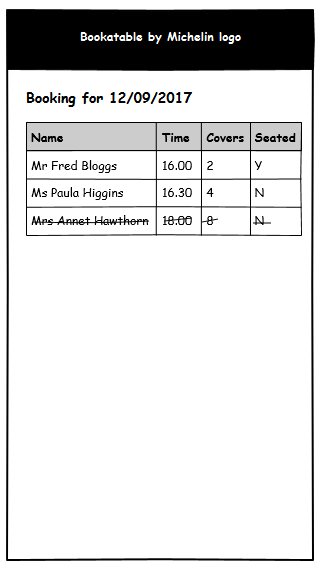
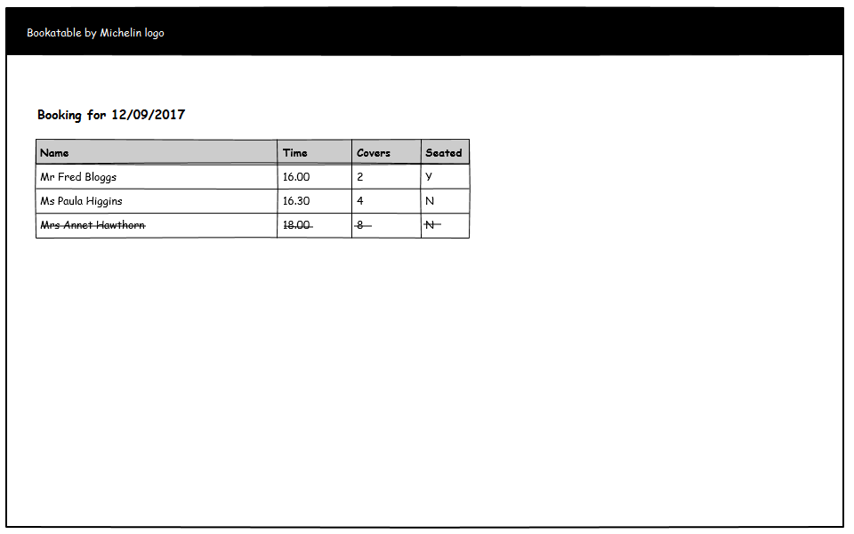
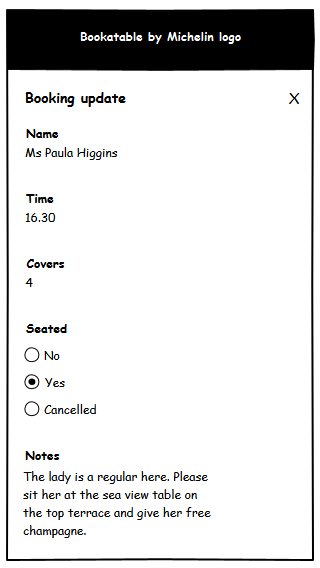
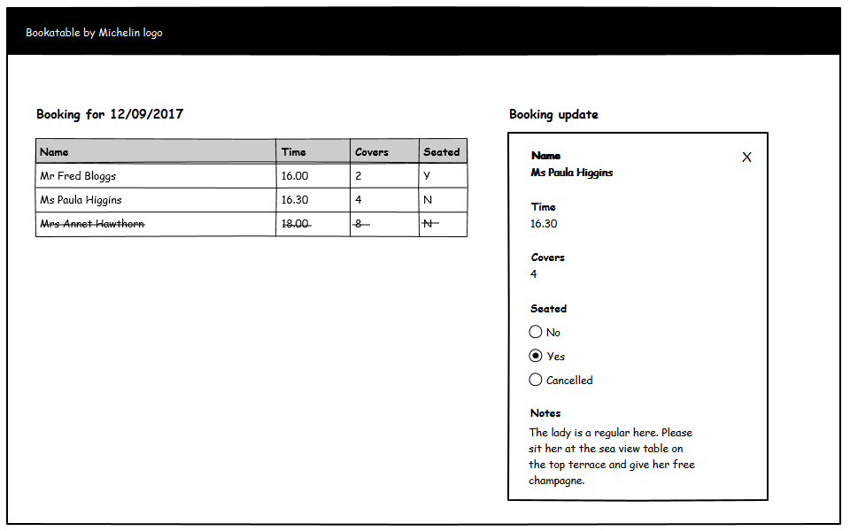

Front End and React Assessment
=====================


## The Task

Estimated time: up to 2 hours (or whatever you feel necessary!)

This is primarily a React JavaScript test, however your overall approach to front end coding, including your use of CSS and semantic HTML, will be assessed. Feel free to make in-line comments to explain your code as necessary.
Added merit will be given for including unit tests or code coverage reports.

### Description

We would like a simple page that allows a restaurant concierge to look at a list of reservations and mark guests as seated when they arrive, or cancelled for no-shows.

This page should make a request to retrieve data from the JSON file provided `bookings.json` (simulating a request to an API) and allow the concierge to mark a diner as one of three states:

* Not seated
* Seated
* Cancelled

Based on the wireframe designs provided, build the page using HTML, CSS (feel free to use a processor) and React JavaScript.

#### Wireframes

**Initial view**


  

  

**Action Panel**

  

  

--------------------------------- 

## User Story

As a restaurant concierge I want to be able to see the status of each of my upcoming reservations so that I respond appropriately when new people turn up and I run the restaurant efficiently.

### Acceptance Criteria

Scenario: As a restaurant concierge I can

- See which diners have already arrived
- Tell which diners have yet to arrive
- Tell quickly which booking to expect to arrive next
- Quickly see which diners have cancelled their bookings
- Change the status of a booking
- Tell one booking from another

---------------------------------

## Development Environment

Please use the minimal dev environment provided, which should include everything required to complete the task.

### Usage

Hot loading / live-editing React components is enabled.

```
npm install
npm start
open http://localhost:3000
```

### Building

A basic production script is included that builds your app to a `dist` folder

```
npm run build
```

### Missing Features

This template is purposefully simple, providing a basic configuration for a development environment using React with Hot Loader. 

You may include additional features, task runners, development tools and modules as you see fit, e.g. testing frameworks, routers, CSS processors etc. with the following exceptions:

* No UI libraries e.g. Bootstrap or Material-UI
* Do not use additional or alternative JavaScript processors i.e. no CoffeeScript, LiveScript or TypeScript
* No JavaScript helper frameworks or animation libraries such as jQuery, Dojo, Velocity etc.

**NB** Be prepared to justify the use of any modules you choose to include or modify.

### WebStorm

Because the WebStorm IDE uses "safe writes" by default, Webpack's file-watcher won't recognize file changes, so hot-loading won't work. To fix this, disable "safe write" in WebStorm.

### Dependencies

- React
- Webpack
- [webpack-dev-server](https://github.com/webpack/webpack-dev-server)
- [babel-loader](https://github.com/babel/babel-loader)
- [react-hot-loader](https://github.com/gaearon/react-hot-loader)

---------------------------------

## Submission instructions

1. Update the main README file in the root directory (not this doc) with any required instructions e.g. for running tests. Please include feedback on what you thought about the test, any parts you were not able to complete and features you would like to add.
2. Remove any files created as part of the installation or build process e.g. `node_modules` and debug output
3. Send your completed project to your recruitment contact using one of these methods:
    - Package up the project in a zip archive 
    - Post to a publicly available git repository and provide access details

### Thank you